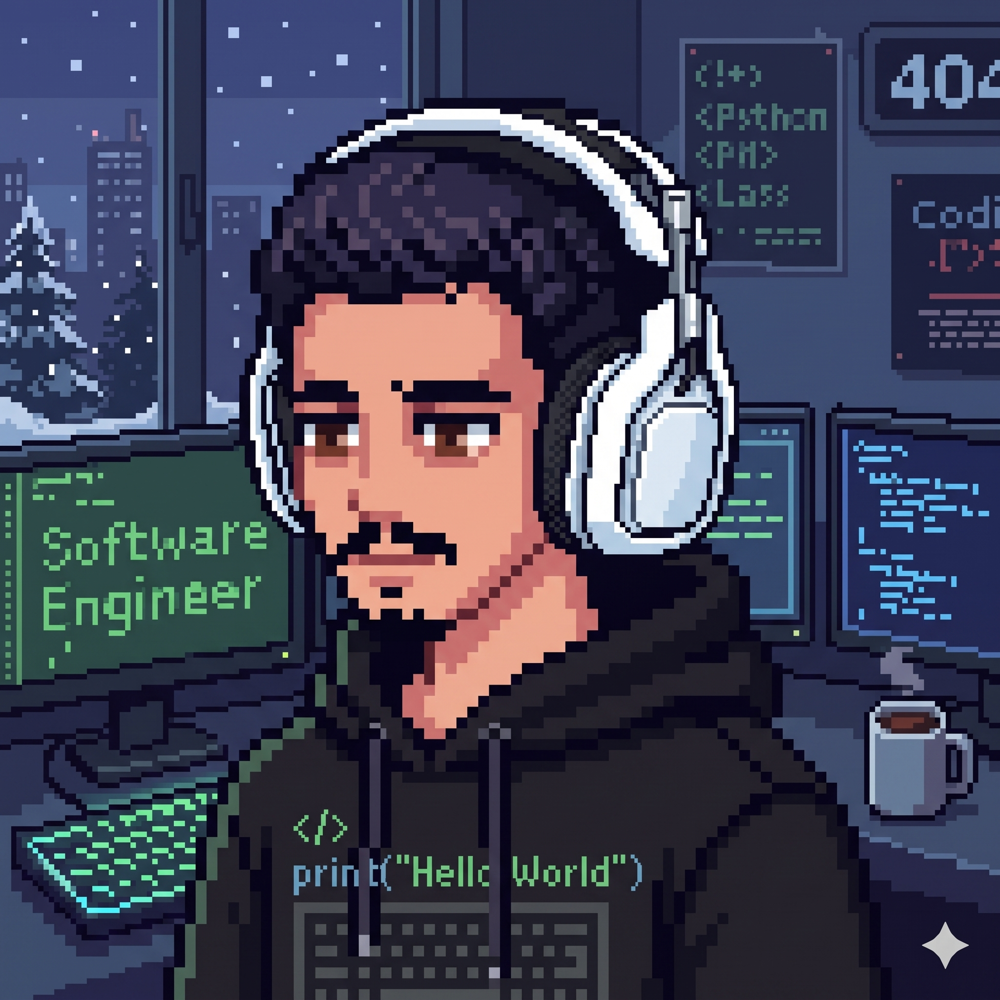
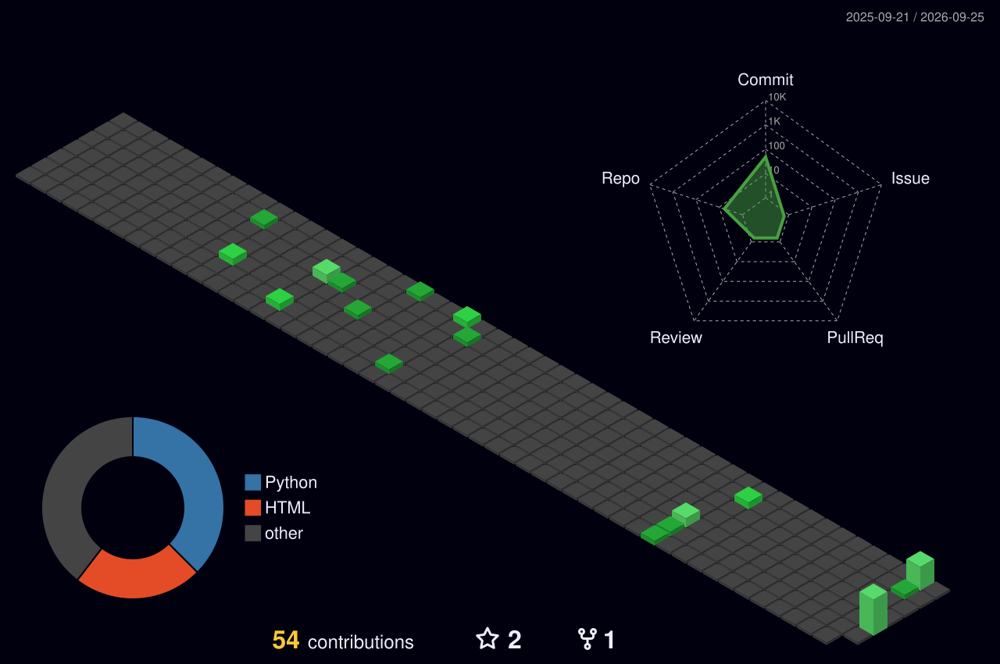

  

 

<table>
  <tr>
    <td width="60%" valign="top">

Olá, me chamo **Rafael Araújo Tenório**, sou engenheiro de software, dados e desenvolvedor back-end. Sou apaixonado por construir ferramentas que simplificam a vida das pessoas. Trabalho na interseção entre desenvolvimento, dados, inteligência artificial e automação, e escrevo sobre o que construo e aprendo pelo caminho.

Construo software e soluções que resolvem problemas reais. Sempre transformando ideias em produtos e de entendendo tudo a partir dos primeiros princípios: se eu não sei como funciona por dentro, ainda não terminei de estudar.

  
  

    </td>
    <td width="40%" valign="top" align="center">
       
      
    </td>
  </tr>
</table>

 

<table align="center">
  <tr>
   </td><td align="center" width="96"> LinkedIn</td>
    </td><td align="center" width="96"> Gmail</td>
  </tr>
</table>

 

  

  

 

  

 

  Código é só o meio · vim para construir coisas que empurram o mundo um pouco mais à frente.

