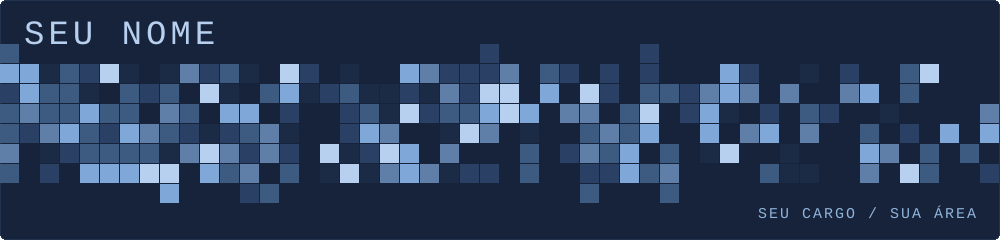

  

 

Olá, eu sou **Seu Nome** — engenheiro(a) de software baseado(a) em Sua Cidade. Sou apaixonado(a) por construir ferramentas que simplificam a vida das pessoas. Trabalho na interseção entre desenvolvimento, dados e inteligência artificial, e escrevo sobre o que construo e aprendo pelo caminho.

 

Construo software e soluções que resolvem problemas reais. Não consigo parar de transformar ideias em produtos e de entender tudo a partir dos primeiros princípios: se eu não sei como funciona por dentro, ainda não terminei de estudar.

 

Meu objetivo é ajudar pessoas e empurrar o mundo um pouco mais à frente. Quero fazer parte da geração que faz a tecnologia funcionar de verdade para as pessoas, e não o contrário. Humanidade primeiro, tecnologia depois.

 

Música, pintura, café e pensar diferente: é isso que eu sou fora do teclado.

 

<table align="center">
  <tr>
    <td align="center" width="96"> GitHub</td>
    <td align="center" width="96"> LinkedIn</td>
    <td align="center" width="96"> X</td>
    <td align="center" width="96"> Gmail</td>
    <td align="center" width="96"> Site</td>
    <td align="center" width="96"> Medium</td>
    <td align="center" width="96"> Kaggle</td>
  </tr>
</table>

 

  

 

<table align="center">
  <tr>
    <td align="center" width="96"> HTML</td>
    <td align="center" width="96"> JavaScript</td>
    <td align="center" width="96"> TypeScript</td>
    <td align="center" width="96"> React</td>
    <td align="center" width="96"> Node.js</td>
    <td align="center" width="96"> Python</td>
    <td align="center" width="96"> PostgreSQL</td>
    <td align="center" width="96"> MySQL</td>
  </tr>
  <tr>
    <td align="center" width="96"> NumPy</td>
    <td align="center" width="96"> Pandas</td>
    <td align="center" width="96"> TensorFlow</td>
    <td align="center" width="96"> PyTorch</td>
    <td align="center" width="96"> Scikit-learn</td>
    <td align="center" width="96"> Docker</td>
    <td align="center" width="96"> Git</td>
    <td align="center" width="96"> Figma</td>
  </tr>
</table>

 

| Projeto | O que faz | Tecnologias |
|---|---|---|
| [**nome-do-projeto**](https://github.com/SEU_USUARIO/nome-do-projeto) | Uma frase explicando o problema que ele resolve. | Python · FastAPI |
| [**outro-projeto**](https://github.com/SEU_USUARIO/outro-projeto) | Uma frase explicando o problema que ele resolve. | React · TypeScript |
| [**mais-um-projeto**](https://github.com/SEU_USUARIO/mais-um-projeto) | Uma frase explicando o problema que ele resolve. | Node.js · PostgreSQL |

 

  Código é só o meio · vim para construir coisas que empurram o mundo um pouco mais à frente.

